# Create React App with Lambda funciton

1. Create React App using Amplify to host 
    a. I also added the code to make a request to API gateway that is open to everyone (I was try to secure but did not have time)
    b. I wrote code to get a image from a form in the React app
    c. All code is in the App.js
    d. Not really good at frontend

2. Created Lambda Function in python
 a. I just wrote a simple script that take the files and addes to S3 Bucket
 b. I also added the function to this repo is the python filed named lambd_function.py
 c. I ran into an error but It had to do with the way I was setting up my API Gateway
 d. I added permisison to the lambda function to be able to access S3
    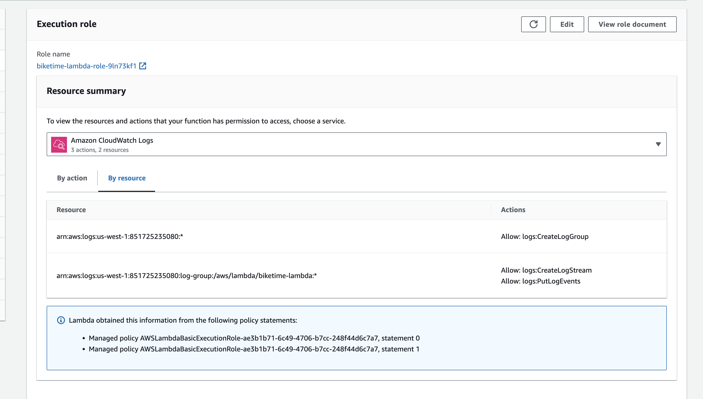
    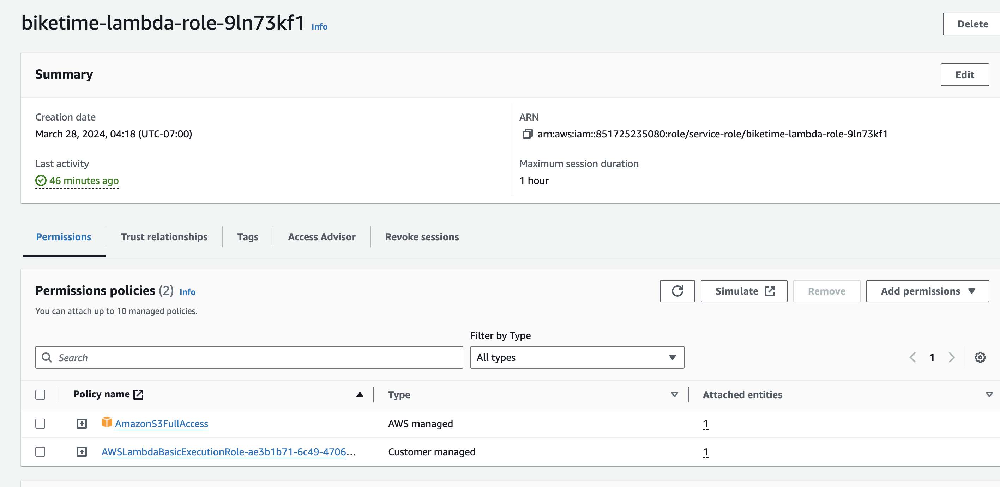

3. Created API Gateway for the fontend React app to communicate with Lambda function
 a. I created the API gatway for it to also function as a trigger to the Lambda function
 b. There was a few settings I need to complete before the API Gateway could be ready under API setting I need to manage what type of Binary media types I would allow. This I cause me a few headaches
    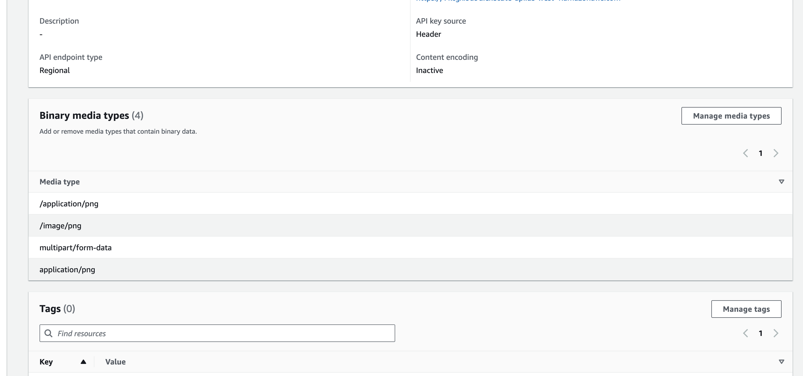

 c. Next I had to set up a route to send the request to so I ccreated a route "/upload" it was a POST request. 
    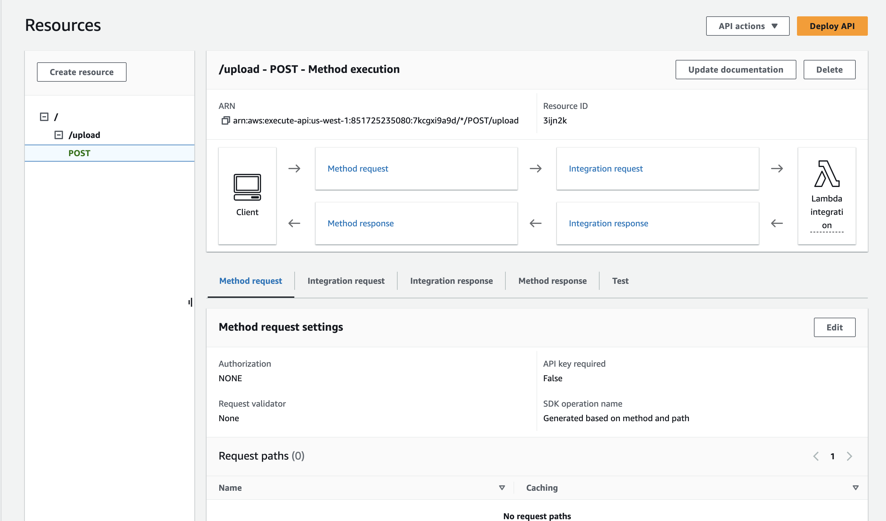

 d. I also had to do changes to the integration request to accept binary media types
    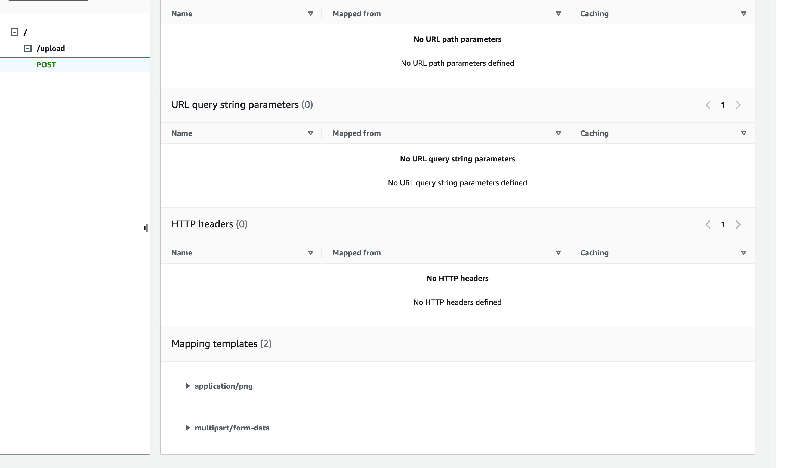
 e. After that all that was left was diploy it (also this was open to all public)

 f. Finally added the API Gateway as a trigger for the Lambda function so anytime that that route is hit it would invoke the Lambda fucntion
    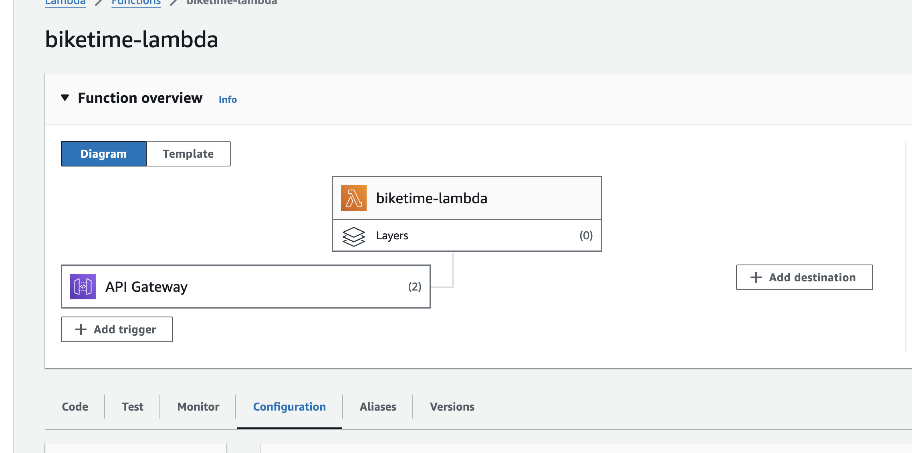

4. Create a S3 bucket
    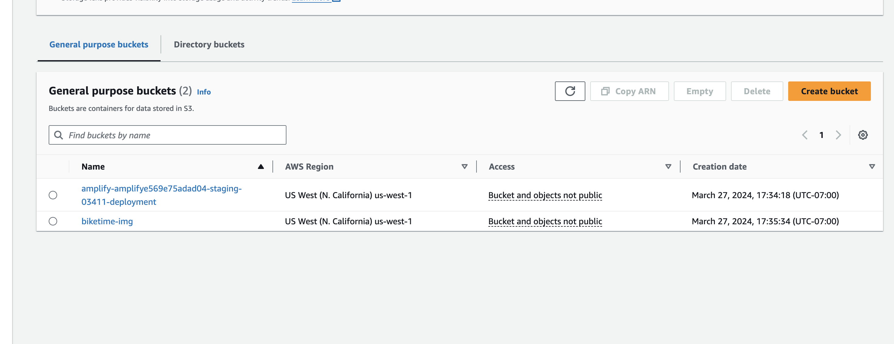
 a. The Lambda function added the image we uplaoded triggered by the API gateway. 
    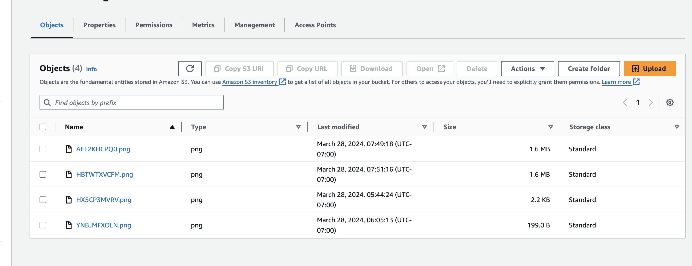

5. Here below I added the architecture diagram. I made some in the beginning but It did not go as plan.
    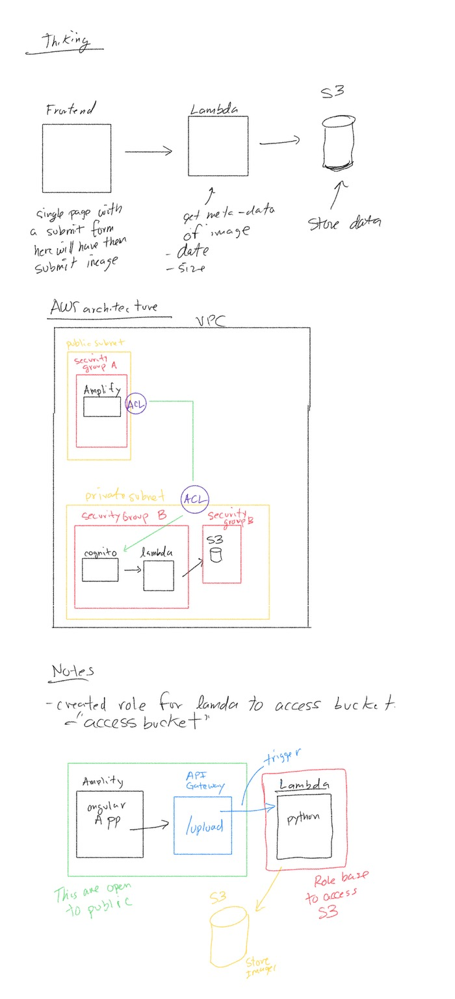

# second part adding DynamoDB

1. I creates a DynamoDB to store metadata 
a. I created a table called "biketime-table" to store the data 
b. Made sure that lambda function has enought permission to access DynamoDB to store data
   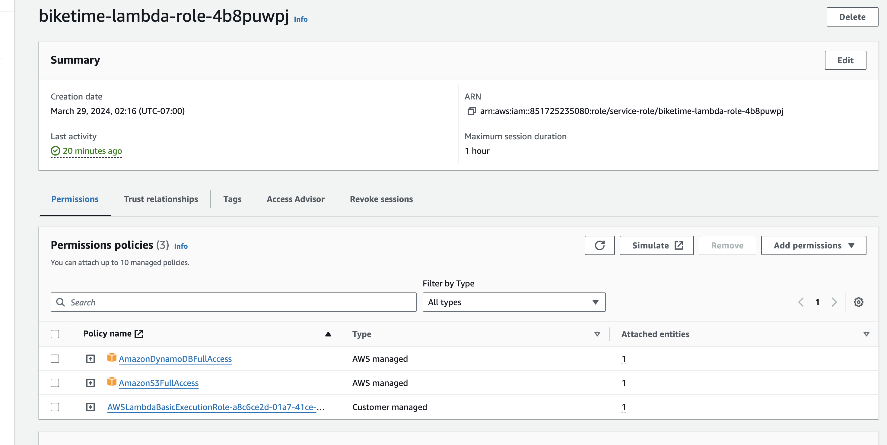
c. Then I used the lambda function to get the metadata from S3 then I stored using the name of the image as index
   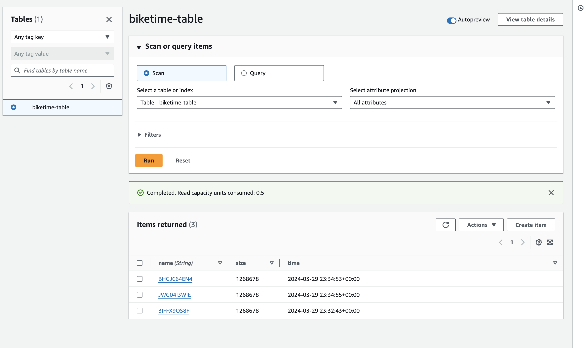

   This part all I had to do is update the code to get the metadata then send it to DynamoDB